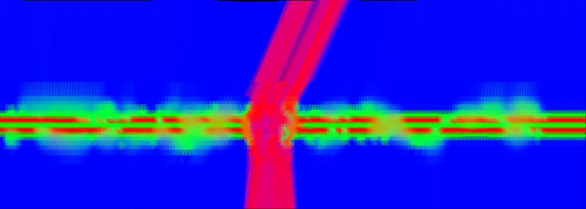

# Як чужі ігри будують дорогу (розбір 24.09.2026)

Розібрано **три встановлені збірки** — саме дорогу/поверхню, а не оточення:

| гра | пакет | рушій | що з неї беремо |
|---|---|---|---|
| Hill Drive | `com.hypermonkgames.HillDrive` | Unity 6.3, URP | дорога по сплайну, вершинні кольори, шум-плями |
| Water Power | `com.mountaincreekgames.waterpower` | Unity 2021/2022, вбудований | найдешевший мультяшний ґрунт: **1 вибірка, 28 інструкцій** |
| Raft (Ocean Survival) | `com.mega_play_games.ocean.raft...` | Unity 6.0, вбудований | дошки різної довжини: джиттер вершин + атлас відтінків |

Ігор **не запускали** — телефон був зайнятий заміром. Тому тут **немає жодного числа про
кадр**; усе, що нижче, — це те, що видно у файлах, плюс оцінки ціни за нашими власними
попередніми замірами. Будь-яка цифра «скільки коштуватиме» вимагає контрольного прогону
(див. `visual-check-needs-control-run` у memory bank).

Як знято: `adb shell pm path` + `adb pull`, розпакування, UnityPy 1.25.3 у власному
venv `/tmp/venv_road`. Скрипти — `/tmp/{hilldrive,waterpower,raft}/*.py`, у репозиторій не
додавались. Витягнуті текстури — `docs/optimisation/shots/2026-09-24-doroha-*.png`.

---

# 1. Hill Drive — головна ціль

## 1.1 Геометрія: один меш, один матеріал, один підмеш, жодного зазору

Гілка `RoadMeshRoot` кожної цеглинки містить **рівно один MeshRenderer**. Виміряні 39
унікальних мешів дороги (67 рендерерів):

| | значення |
|---|---|
| підмешів | **1** в усіх 39 |
| матеріалів на рендерер | **1** |
| габарит меша | **~100 × 35,5 м** (довжина × повна ширина зі узбіччями й травою) |
| вершин | 4 477 … 8 648 (типово ~6 500) |
| трикутників | 7 000 … 13 000 |
| **вершин на метр довжини** | **44 … 86** |
| **вершин на м²** | **2,4** |
| зазори між елементами | **немає** — меш суцільний, зварений |

Меш будується по сплайну: у цеглинці є гілка `Spline` і скрипти `RoadWidthController`,
`RoadWidthSegment`, `PathFollowSplineIndicator`.

**Порівняння з нами.** Наша дорога (`src/run3d/track.gd`) на один метр дає:

```
поверхня   MAX_LANES 7 × 24 верш. = 168
край       2 × 24                 =  48
центр      1 × 24                 =  24
узбіччя    4 × 24                 =  96
обрив      CLIFF_LAYERS 3 × 2 × 24= 144
шви        MAX_SEAMS 6 × 24       = 144
------------------------------------------
                                   ≈ 624 вершини на метр
```

При ширині 3,2 + 2×8 = 19,2 м це **32,5 вершини на м²** — **у 13 разів щільніше за Hill
Drive**, і це при тому, що вони малюють реалістичну дорогу, а ми мультяшну. Плюс у нас
~10 окремих MultiMesh проти їхнього одного меша, і **зазор `TILE_GAP = 0,02 м` між
плитками навмисний** — тобто сітку ми малюємо свідомо.

## 1.2 Матеріал і текстури

Матеріал дороги (`RP_RoadMaterialForest`, шейдер `Hypermonk/Environment`) — **шість текстур**:

| слот | текстура | розмір | тайлінг (`_ST.xy`) |
|---|---|---|---|
| `_Road` | `S1-Offroad_Defuse` | 1024² | 1,0 |
| `_Road_Normal` | `S1-Offroad_Normal` | 512² | 1,0 |
| `_Transition` | `Soil_3_Diffuse` | 1024² | 1,0 |
| `_Transition_Normal` | `S1-Offroad_Normal` | 512² | 0,5 |
| `_Vegetation` | `Grass_02_T_A` | 1024² | 1,0 |
| `_Vegetation_Normal` | `Grass_A_Normal` | 512² | 1,0 |

Усі шість читаються **з одного набору UV0**, кожна зі своїм `_ST`. Текстури — безшовні
фотографічні (Poly Haven / textures.com: `TCom_*`, `rocky_trail_02_diff_1k`,
`cobblestone_floor_08_diff_2k`). Зразки: `2026-09-24-doroha-hilldrive-road-albedo.png`,
`-transition-albedo.png`, `-grass-albedo.png`, `-cobblestone-albedo.png`.

**Період тайлінгу — головне число.** UV0 меша `SE.039`: U від −3,37 до 6,21 на 35,6 м
ширини, V від −0,02 до 26,98 на 100,8 м довжини. Тобто **одне повторення текстури ≈ 3,7 м**
в обох напрямках. Не 1 м, не розмір клітинки — **3,7 м**. Око не ловить повтор такого
періоду, бо він більший за крок гравця й не збігається ні з чим у геометрії.

## 1.3 Як досягається нерівність: ВЕРШИННІ КОЛЬОРИ

Головна знахідка. У вершинному шейдері рівно два рядки корисної роботи:

```glsl
vs_INTERP6 = in_TEXCOORD0;   // UV
vs_INTERP7 = in_COLOR0;      // вершинний колір — ПРЯМИМ ТЕКСТОМ, без обробки
```

А у фрагментному вершинний колір — це ваги трьох шарів:

```glsl
// A = альбедо дороги (вже підфарбоване, див. 1.5)
t1 = A * COLOR.r;                              // R — вага дороги
t0 = mix(A*COLOR.r, transition, COLOR.g);      // G — вага перехідної смуги
t0 = mix(t0,        vegetation, COLOR.b);      // B — вага трави
```

Канал прозорості вершинного кольору не використовується взагалі (A = 255 всюди).

Меш `SE.039`: 8 648 вершин, у каналі кольору **255 різних значень R, 256 G, 256 B** — це не
три дискретні маски, а **намальоване від руки неперервне поле**. Розріз упоперек дороги
показує плавний перехід R→G→B протягом 2–3 м.



`shots/2026-09-24-doroha-hilldrive-vertex-colors.png` — це той самий меш `SE.039` згори,
кожен трикутник залитий середнім вершинним кольором. Червона смуга — дорога, зелена —
гравійне узбіччя, синє — трава. **Зелена смуга гуляє вздовж дороги нерівно** — от і вся
«нерівність краю». Жодної маски-текстури, жодної окремої геометрії краю, жодної альфи.

## 1.4 Краї дороги

Відповідь однозначна: **змішування в шейдері за вершинним кольором**. Не окрема геометрія,
не альфа-маска, не маска-текстура. Край нерівний, бо **вершинний колір пофарбований
нерівно**, а інтерполяція по трикутнику робить перехід м'яким безкоштовно.

## 1.5 Плями відтінку — процедурний шум

Друге джерело нерегулярності. У матеріалі є `_Mud_Noise = 9,2`, `_Mud_A = 0,542`,
`_Mud_B = 0,360`, `_Color = (0,679)`, `_Mud_Color = (0,708)`.

У фрагменті це **Unity Shader Graph «Simple Noise»**, розгорнутий у ~110 інструкцій:

- **три октави** value-noise на UV × `_Mud_Noise`, з частотами ×1, ×0,5, ×0,25 і вагами
  0,125 / 0,25 / 0,5;
- кожна октава — **чотири цілочислові хеші** (`^1103515245u`, `*668265261u`, `>>5`, `>>8`),
  тобто **12 хешів на піксель**;
- smoothstep-інтерполяція між вузлами (`t*t*(3-2t)`);
- результат проганяється через `smoothstep(_Mud_A, _Mud_B, n)` і **лерпить альбедо дороги
  між двома тінтами** `_Color` і `_Mud_Color`.

Два числа, які варто винести окремо:

- **розмір плями.** UV-період 3,7 м ÷ 9,2 = **0,40 м** на найдрібнішу октаву; октави
  0,40 / 0,80 / **1,61 м**, і саме найбільша має найбільшу вагу (0,5). Тобто домінантна
  пляма — **приблизно півтора-два метри**.
- **сила плями.** `_Color` 0,679 проти `_Mud_Color` 0,708 — різниця **4 %** яскравості.
  Це дуже слабкий ефект. Він не «розфарбовує» дорогу, він лише **ламає одноманітність**.

## 1.6 Шейдер: скільки вибірок і скільки ALU

Блоб витягнуто (`compressedBlob` → lz4 → GLES3-джерело; платформа 9). Фрагмент варіанта без
лайтмапів, тобто той, що реально малює дорогу:

| | `Hypermonk/Environment` | `Hypermonk/Environment Andriod 1` |
|---|---|---|
| розмір блоба | 466 156 Б | **273 868 Б** (−41 %) |
| **вибірок із текстур матеріалу** | **6** (`_Road`, `_Road_Normal`, `_Transition`, `_Transition_Normal`, `_Vegetation`, `_Vegetation_Normal`) | **4** (`_Road`, `_Vegetation`, одна bump, одна ще) |
| інструкцій (`;`) у фрагменті | **755** | **352** |
| `floor` / `fract` | 2 / 2 | **0 / 0** |
| `dot` | 29 | 30 |
| шарів змішування | три (Road / Transition / Vegetation) | **два** |

**Найважливіше в цій таблиці — нулі.** У Android-варіанті `floor` і `fract` нуль, тобто
**вони самі викинули процедурний шум зі своєї мобільної версії**. Замість нього стоїть
`_SampleTexture2D_…` із типом за замовчуванням `"bump"` — вибірка з текстури. Це рівно те
правило, яке ми записали собі в memory bank 24.09: *процедурний візерунок у пікселі спершу
перевіряти на запікання*. Розробники Hill Drive прийшли до того самого висновку.

Змішування шарів в Android-варіанті теж спростили до одного лерпа:

```glsl
veg  = texture(_Vegetation, UV);
road = texture(_Road,       UV);
c    = mix(veg, road, COLOR.r + COLOR.g);   // дві ваги склали в одну
```

Ще деталь: нормаль в Android-варіанті рахується **з висоти через екранні похідні**
(`dFdx`/`dFdy` від однієї скалярної вибірки) — тобто вони економлять на нормаль-мапі, але
платять двома похідними. Нам це не потрібно: ми нормалей не використовуємо взагалі.

---

# 2. Water Power — найдешевший мультяшний ґрунт із трьох

Гра не бігун, а «побудуй електростанцію на річці», але саме її матеріали найближчі до
нашого стилю: пласкі кольори, мультяшне освітлення, слабкі телефони.

## 2.1 Геометрія

- Ґрунт-основа — **`Plane` з 4 вершин на 119,9 × 56,4 м**. Дешевше не буває.
- Смуги зон (трава / пісок / сніг) — окремі ProBuilder-меші з окремими матеріалами
  `Zone 1`…`Zone 6`, `Sand`.
- Береги річки й фонові будинки цілого світу зведені в **~25 мешів `World5_River*_BH_*`**
  (820…10 249 вершин, 1 підмеш), **усі на одному матеріалі** `World5_River1__BH` з
  **однією текстурою 256×256**. Це запікання цілої сцени в один матеріал.
- На цих мешах **вершинні кольори є на кожній вершині** (10 249 вершин — 10 249 кольорів).

## 2.2 Матеріал і текстури

Дві різні техніки в одній грі:

**а) Тайл + тайлінг.** `Zone 1` = `plan 2` 256² з тайлінгом **×11**, `Zone 3` = `grass 3`
256² ×9, `Zone 4` = `snow 2.1` 256² ×15, `sand 4` = `sand 2` 256² ×22. Тобто
**256-піксельна безшовна плитка, розтягнута на десятки метрів** — і все. Жодних масок,
жодних шарів. Зразок: `2026-09-24-doroha-waterpower-grass-tile.png`.

**б) Палітра.** `palette` 256×256 — це **сітка кольорових квадратиків**
(`2026-09-24-doroha-waterpower-palette.png`). Геометрія не має власної текстури: UV кожного
полігона вказує в потрібний квадратик палітри. Так само зроблені `World _1-River _1_256x256`
і `BH_World5` — це теж палітри, а не картинки. **Одна текстура 256² на цілий світ.**

Окремо в грі лежать намальовані від руки острови для карти світу — `mainland 1..6 square`
512² плюс `… BW square` (чорно-біла копія) і `… light square`
(`2026-09-24-doroha-waterpower-mainland-albedo.png` і `-mask.png`). **Жоден 3D-матеріал на
них не посилається** — це, найпевніше, UI карти світу, а не ґрунт. Наводжу як ілюстрацію
прийому «край намальований, а не змодельований», а не як доказ.

## 2.3 Шейдер: 1 вибірка, 28 інструкцій

Шейдер ґрунту — `Toony Colors Pro 2/Hybrid Shader 2`. Блоб GLES3 витягнуто (23,9 МБ, 4 656
варіантів). Найдешевший варіант із `_HColor`/`_SColor` (тобто реальний ґрунт):

```glsl
void main() {
    n   = normalize(vs_NORMAL0) * frontFacing;
    l   = normalize(_WorldSpaceLightPos0.xyz);
    t   = dot(n,l) * 0.5 + 0.5;
    t   = smoothstep(_RampThreshold - _RampSmoothing*0.5,
                     _RampThreshold + _RampSmoothing*0.5, t);
    ramp = mix(_SColor, _HColor * _LightColor0, t);
    albedo = texture(_BaseMap, uv).rgb * _BaseColor.rgb;   // ЄДИНА вибірка
    SV_Target0 = vec4(ramp * albedo, 1.0);
}
```

**1 вибірка, 28 інструкцій, без нормалей, без масок, без другого шару.** Ось ціна
мультяшного ґрунту, який виглядає як наш референс. Для порівняння: повний шейдер Hill Drive
— 6 вибірок і 755 інструкцій.

Мультяшне освітлення тут — двоколірна рампа через один `smoothstep`, а не текстура-рампа.

---

# 3. Raft — «дошки різної довжини»

## 3.1 Геометрія: джиттер вершин у модельєрі

Меш `Floor` — плита плоту **2,00 × 1,64 м, 192 вершини, 1 підмеш, 1 матеріал**. 192 ÷ 24 =
**рівно 8 коробок**, зведених в один меш (6 дощок + дві поперечні балки). Координати
вершин:

```
поперек (вісь X), межі дощок:
  -1,000 −0,994 │ −0,660 −0,657 −0,654 −0,651 −0,648 │ −0,343 … −0,320 │
  −0,031 … −0,013 │ 0,324 0,326 0,332 0,334 0,342 0,352 │ 0,668 … 0,693 │ 0,999 1,000

уздовж (вісь Z), КІНЦІ дощок:
  −0,999 −0,996 −0,993 −0,991 −0,990 −0,981 −0,914 −0,738
   0,379  0,555  0,630  0,636  0,641
```

Читається одразу:

- **6 дощок по ~0,33 м завширшки** на плиту 2 м (плюс дві балки знизу);
- **бічні межі дощок зсунуті одна відносно одної на 3–30 мм** — дошки не однакової ширини;
- **кінці дощок розкидані від 0,379 до 0,641 м** — це **26 см розкиду** на плиті довжиною
  1,64 м, тобто **±16 %**. А з іншого боку — від −0,999 до −0,738, ще 26 см.

Тобто «дошки трохи різної довжини» — це **не шейдер і не текстура, а зсунуті вершини в
моделі**. Кожна дошка обрізана по-своєму; плита від цього перестає читатися як штамп.

Вершинних кольорів у цих мешах **немає взагалі**.

## 3.2 Матеріал і текстури: атлас відтінків

Матеріал `Atlas_Wood`, шейдер `MeGaMe/PBR_GLES_20_RAFT` (fallback `Mobile/Diffuse`),
**дві текстури**: `Atlas_Wood_AlbedoTransparency` 1024² + `Atlas_Wood_Normal` 512².
Тайлінг **1,0**, UV усіх мешів лежать у діапазоні 0…1 — тобто **тайлінгу немає, кожен
полігон має власний шматок атласа**.

Сам атлас (`2026-09-24-doroha-raft-wood-atlas.png`) — це **кілька великих смуг деревини
різного відтінку**: темно-коричнева, вохриста, світло-медова, сіра. Ніяких «дощок» у ньому
не намальовано.

**Ось прийом.** UV кожної дошки зсунутий у СВОЮ смугу атласа. Одна текстура, один матеріал,
одна вибірка — а кожна дошка іншого відтінку. Ціна: **нуль**. Це саме те, що показує
референс «дошки впоперек, кожна свого відтінку».

## 3.3 Що з дорогою в Raft

Дороги в сенсі траси там немає — пліт збирається з плиток 2×2 м на сітці, і **зазори між
плитами є за задумом** (це будівельна гра). Але шейдер траси там один на всю гру: 1–2
вибірки, `Mobile/Diffuse` як запасний. Нічого дорожчого.

---

# 4. Зведення трьох ігор

| | Hill Drive | Water Power | Raft |
|---|---|---|---|
| дорога — один меш чи плитки | **один меш** по сплайну | один Plane 4 верш. + зонні меші | плитки 2×2 м (це будівельна гра) |
| підмешів / матеріалів на об'єкт | 1 / 1 | 1 / 1 | 1 / 1 |
| вершин на метр | 44…86 (ширина 35 м) | ~0 | 96 на метр ширини плоту |
| зазори між елементами | **немає** | немає | є (за задумом) |
| текстур на дорогу | 6 (Android: 4) | **1** | 2 |
| розмір текстур | 512…1024 | **256** | 1024 + 512 |
| тайлінг, період | **3,7 м** | ×9…×22 на весь меш | **немає**, унікальні UV |
| чим ламають регулярність | **вершинний колір** + 3-октавний шум | палітра + великі меші | **джиттер вершин** + атлас відтінків |
| як трава переходить у дорогу | **лерп за вершинним кольором** | окремі зонні меші | — |
| вибірок у фрагменті | 6 / **4** | **1** | 1–2 |
| інструкцій у фрагменті | 755 / **352** | **28** | не міряно |

**Спільне в усіх трьох:** один об'єкт — один матеріал — один підмеш; жодна з трьох ігор не
складає поверхню з однакових прямокутників із швами.

**Різне:** ламають регулярність трьома різними способами, і всі три коштують по-різному —
вершинний колір і джиттер вершин **безкоштовні в пікселі**, шум — **ні**.

---

# 5. Що робити з нашою дорогою

## 5.1 Звідки ми стартуємо

Наш матеріал дороги — `StandardMaterial3D` із `vertex_color_use_as_albedo = true`
(`track.gd:760`), **без жодної текстури**. Тобто на піксель дороги ми зараз робимо **нуль
вибірок**. За нашими власними замірами вибірка з текстури ≈ безкоштовна, а математика на
піксель дорога. **Отже, на вибірках у нас повний бюджет вільний, і саме туди треба витрачати.**

Зайвий повноекранний шар дорогий — тому **жодна з пропозицій нижче не додає ані шару, ані
прозорості**.

## 5.2 Варіант A — джиттер геометрії. Ціна в пікселі: НУЛЬ

Прийом Raft. Нічого не додавати в шейдер, лише міняти трансформи в буфері MultiMesh:

1. **Плитці — випадкові розміри.** Зараз `tile_mesh.size = (LANE_W − 0,02, 0,06, 1 − 0,02)`
   однакова для всіх 308 інстансів. Дати кожній плитці масштаб 0,88…1,0 по обох осях і
   зсув у межах клітинки — з seed від `_row_seed[i]` і номера доріжки, щоб було
   відтворювано. Raft розкидає кінці дощок на **±16 %** — це і є орієнтир.
2. **Краю — нерівність.** `_mm_edge` (`EDGE_W = 0,3`) уже існує саме для цього, але
   однаковий. Дати йому на рядок випадкову ширину 0,15…0,45 і зсув ±0,1 м, а раз на
   4–6 рядів — «язик» трави, що заходить на дорогу на 0,3–0,5 м.
3. **Прибрати поперечний шов** (`_mm_xseam` уже `visible = false` — добре) і **зменшити
   `TILE_GAP`** з 0,02 до 0,005…0,01 там, де тема не «бруківка»: саме рівний зазор 2 см
   по всій дорозі й читається як друкована сітка.

- **Ціна:** нуль інструкцій і нуль вибірок на піксель. Змінюються лише числа в буфері
  MultiMesh, а він і так переписується щокадру при прокрутці. Вершин не додається.
- **Що дає:** зникає «штамп» — плитки перестають бути ідентичними, край перестає бути
  лінійкою. Це прямо б'є в скаргу замовника.
- **Чого не дає:** плитка лишається плиткою, всередині неї нічого не намальовано.
- **Праця:** пів дня в `track.gd` + тести на розстановку.

**Це перший крок, і його треба робити в будь-якому разі.**

## 5.3 Варіант B — атлас відтінків на плитку. Ціна: +1 вибірка, +2 mad

Прийом Raft (`Atlas_Wood`). Замість суцільного кольору на інстанс — шматок атласа:

1. Намалювати **один атлас 512×512** (наш стиль, не фото): сітка 4×4 з 16 варіантів
   поверхні по 128×128 — плита, дошка, бруківка, витоптаний пісок, кожен у 2–3 відтінках.
   Можна класти в один атлас усі теми траси.
2. Увімкнути `mm.use_custom_data = true` **до** `instance_count` (так само, як `use_colors`
   зараз, і з тим самим застереженням про перевиділення буфера — `track.gd:629`).
3. У `INSTANCE_CUSTOM` класти `(u0, v0, du, dv)` — комірку атласа на плитку.
4. Шейдер:

```glsl
// fragment
vec2 uv = UV * INSTANCE_CUSTOM.zw + INSTANCE_CUSTOM.xy;
ALBEDO = texture(atlas, uv).rgb * COLOR.rgb;
```

- **Ціна:** **одна вибірка** (у нас зараз нуль) + два множення-додавання. За нашими
  замірами це в межах шуму детектора (0,6 пункта), але **міряти обов'язково**, з
  контрольним прогоном і по два прогони на варіант.
- **Що дає:** кожна плитка має власний малюнок — тріщини, фаски, мох, зернистість. Разом
  із варіантом A сітка зникає остаточно.
- **Ризик:** мип-мапи атласа течуть між комірками. Лікується або `mipmaps = off` (плитка на
  екрані велика, мипи нам майже не потрібні), або паддингом 4 пікселі навколо кожної комірки.
- **Праця:** день коду + малювання атласа.

**Важливо для «дошок різного відтінку»:** відтінок брати НЕ з `COLOR`, а з того, у яку
комірку атласа потрапила плитка — тоді дошки будуть різні, як у Raft, і без жодної
додаткової математики.

## 5.4 Варіант C — стрічка з вершинними кольорами. Ціна: +2 вибірки, +6 mad, МІНУС 13× вершин

Прийом Hill Drive, повний. Замість 308 плиток + краю + узбіч — **одна стрічка-`ArrayMesh`**
на видимий відрізок, що перебудовується при зсуві рядів:

1. Поперечний переріз: ~24 вершини (центр дороги, узбіччя, трава, обрив), крок уздовж —
   0,5 м. На 44 м це **~2 100 вершин** замість нинішніх ~27 000 (624 × 44). **Мінус 13×.**
2. **UV із періодом 3,7 м**, як у Hill Drive — не 1 м і не розмір клітинки. Це критично:
   період, кратний метру, ловиться оком як сітка.
3. **Вершинний колір**: R = дорога, G = узбіччя, B = трава. Межу R/G і G/B **джиттерити
   вздовж на ±0,3 м** з того самого `_row_seed` — і край стане нерівним рівно так, як на
   картинці `2026-09-24-doroha-hilldrive-vertex-colors.png`.
4. Шейдер:

```glsl
vec3 road  = texture(tex_road,  UV).rgb;
vec3 grass = texture(tex_grass, UV * 1.3).rgb;
ALBEDO = mix(grass, road, COLOR.r + COLOR.g) * COLOR_TINT;
```

- **Ціна:** дві вибірки замість нуля, один `mix` (3 mad). У пікселі — практично нічого.
  У вершинах і викликах малювання — **виграш**: мінус ~8 MultiMesh і мінус 13× вершин.
  Цілком імовірно, що варіант C **зменшить** кадр, а не збільшить. Але це припущення, яке
  треба перевірити заміром.
- **Що дає:** усе, що є в референсі прибережної стежки — м'який нерівний край, трава, що
  заходить нерівно, жодних швів, жодної сітки.
- **Чого коштує:** переписати геометрію дороги в `track.gd` — найбільша робота з трьох, і
  вона ламає нинішню логіку «плитка на клітинку», якою користуються маркери рівнів
  (`docs/chunks.md`). Треба окремо продумати, як кладеться геймплейна сітка поверх стрічки.
- **Праця:** 3–5 днів із тестами.

## 5.5 Плями відтінку — окремо, і ТІЛЬКИ ЗАПЕЧЕНІ

Незалежно від варіанта, «відтінки плавають плямами» з референсу робиться так:

- **одна безшовна сіра текстура шуму 256×256** з періодом **8–12 м** (не 1 м!);
- у шейдері `ALBEDO = mix(tint_a, tint_b, texture(noise, world_uv).r)`;
- різниця між `tint_a` і `tint_b` — **4 %** яскравості, як у Hill Drive (0,679 проти 0,708),
  не більше. Ефект має бути на межі помітності.
- **Ціна:** +1 вибірка, +3 mad. Нуль математики.

**Категорично не робити це процедурно.** Hill Drive витрачає на свій 3-октавний шум ~110
інструкцій і 12 цілочислових хешів на піксель — і **сама викинула його зі своєї
Android-версії** (`floor`/`fract` там нуль). Ми вже маємо це правило в memory bank; тут
воно підтверджене чужим кодом.

## 5.6 Чого НЕ брати

1. **Не брати шість вибірок Hill Drive.** Три альбедо + три нормалі на найбільшій площі
   екрана — рівно та стаття, яку ми зрізали.
2. **Не брати карти нормалей.** У нас мультяшне освітлення без нормалей — це наша перевага
   над усіма трьома іграми.
3. **Не брати трюк Hill Drive із `dFdx`/`dFdy`** для нормалі з висоти. Дві похідні на
   піксель заради ефекту, якого наш стиль не потребує.
4. **Не брати фотографічні текстури.** Їхні `S1-Offroad_Defuse` і `Soil_3_Diffuse` — фото;
   наш референс мальований. Беремо метод (період 3,7 м, атлас відтінків), не картинки.
5. **Не додавати третій шар змішування.** Навіть Hill Drive у своєму Android-варіанті
   звівся до двох.

## 5.7 Порядок дій

| крок | що | ціна в пікселі | ефект |
|---|---|---|---|
| 1 | Варіант A — джиттер плиток і краю | **0** | сітка перестає бути правильною |
| 2 | Шум-плями із запеченої текстури (5.5) | +1 вибірка | відтінки «плавають» |
| 3 | Варіант B — атлас відтінків на плитку | +1 вибірка | кожна плитка своя |
| 4 | Варіант C — стрічка з вершинними кольорами | +2 вибірки, −13× вершин | нерівний край, зникають шви |

Кроки 1–3 не чіпають геймплейну сітку і роблять ~80 % того, що видно на референсі.
Крок 4 — окрема велика робота, і братися за неї варто лише якщо після 1–3 замовник усе ще
бачить сітку.

**Кожен крок — із заміром за правилом контрольного прогону** (`RESET=1`, фіксований
`PROFILE=`, по два прогони на варіант), інакше числа брехатимуть.

---

# 6. Чого дізнатися не вдалось

- **Скільки кожна з цих систем коштує в кадрі на реальному пристрої.** Ігор не запускали —
  телефон був зайнятий. Усі оцінки ціни в розділі 5 — це припущення на основі кількості
  вибірок та інструкцій і наших попередніх замірів, а не виміри.
- **Який із двох шейдерів Hill Drive (`Environment` чи `Environment Andriod 1`) реально
  працює на Redmi 8A.** Матеріал із Android-варіантом у збірці один; вибір робиться в
  рантаймі через `QualityController`, і зі збірки він не читається.
- **Фрагмент шейдера Raft у числах.** Блоб `MeGaMe/PBR_GLES_20_RAFT` не розбирався — там
  лише властивості (`_MainTex` + `_NormalsTex`), тож вибірок 2, але кількість інструкцій
  не рахувалась.
- **Чи справді `mainland *.png` у Water Power — карта світу.** Жоден 3D-матеріал на них не
  посилається; висновок зроблено за відсутністю посилань, а не за прямим доказом.
- **Скільки цеглинок траси Hill Drive живе одночасно** — це рантайм, у файлах немає.
